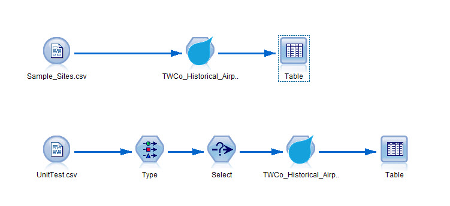
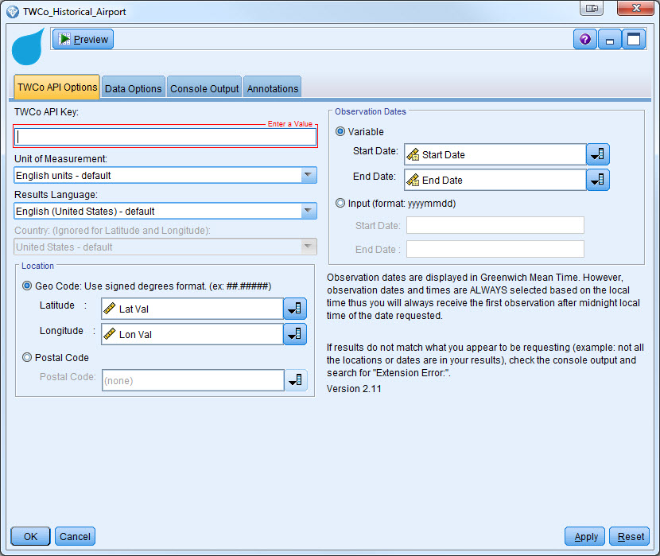

# Extension for TWCo Historical Airport
This implementation allows you to connect to APIs provided by The Weather Company from IBM SPSS Modeler. These APIs will require a key so that you can retrieve the actual weather data. Please contact your IBM sales representative so that we can assist you to obtain the key. 

# Overview
This extension provide capacity to fetch weather observation data through The Weather Company's Historical Observations API. Beside API, this extension can  
1. Pull in any historical weather date range (exceeds the API 30-31 day limit)  
2. Allow multiple lat / long locations input  

# Overview for Standard Site-Based Historical Observations
The Historical Observations API will return past weather observations, up to 1 month (31 days maximum) between the start and end dates parameters. The observations are from METAR and SYNOP reporting stations. Reporting stations report weather observations at different intervals. Some observations are reported hourly, some every 3 hours, every 6 hours, etc. Some stations do not report during nighttime hours. The reporting times per day for each reporting station can also vary. Therefore, this API will simply return all reported weather observations received for a given location and day.

# Notes
1. Because of Modeler issues, "lat" can't show in dailog.
2. All input type(lat, long, startdate, enddate) should be string. 
3. All input column name shouldn't contain space.

# Reference
[The Weather Company](http://www.theweathercompany.com/)
[TWCo Historical Weather](http://goo.gl/DplOKj)

#Requirements

- IBM SPSS Modeler v18
- R Essentials for SPSS Modeler plugin 

More information here: [IBM Predictive Extensions][2]

#License

[Apache 2.0][1]

Contributors
----
- Yu Wenpei [(mail)](yuwenp@cn.ibm.com)

[1]: http://www.apache.org/licenses/LICENSE-2.0.html
[2]: https://developer.ibm.com/predictiveanalytics/downloads/#tab2
